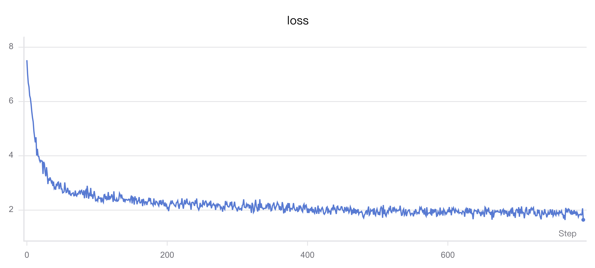

# 03 预训练

## 目标
使用预训练数据训练 MiniMind 基础模型，使其学习语言规律，为 SFT 提供基础权重。

## 训练配置

| 项目 | 配置 |
| :--- | :--- |
| 脚本 | `trainer/train_pretrain.py` |
| 数据 | `dataset/pretrain_t2t_mini.jsonl` |
| 可视化 | SwanLab（`--use_wandb`） |
| 总步数 | 约 39,695 步/轮 |
| 训练轮数 | 2 |
| 检查点目录 | `out/` |

## 命令

### 激活环境并启动训练
```bash
source /root/miniconda3/etc/profile.d/conda.sh
conda activate /root/autodl-tmp/minimind_env
cd /root/autodl-tmp/minimind/trainer
python train_pretrain.py --use_wandb
```

### 单卡运行（替代方式）
```bash
torchrun --nproc_per_node 1 train_pretrain.py


### 查看检查点
```bash
ls -lh /root/autodl-tmp/minimind/out
```

### 保存命令历史
```bash
history | tail -200 > /root/autodl-tmp/minimind/terminal_history_2026-09-18.txt
```

## 实验现象

### Loss 曲线
- 持续下降，曲线平滑。
- 使用 SwanLab 实时监控。
- 初期下降快，后期逐渐趋缓。
- 

### 学习率曲线
- 平滑下降，符合余弦退火调度。
- 初期大学习率快速下降 loss，后期小学习率稳定收敛。
- 下降规律：先 Warmup，再余弦衰减至接近 0。

### Epoch time
- 呈阶梯型下降。
- 第一个 epoch 最慢，后续 epoch 速度提升后趋于稳定。

### 训练进度
- 第一轮约 39,695 步。
- 第一轮完成后自动进入第二轮。
- 第二轮结束后训练停止。


## 待补充
